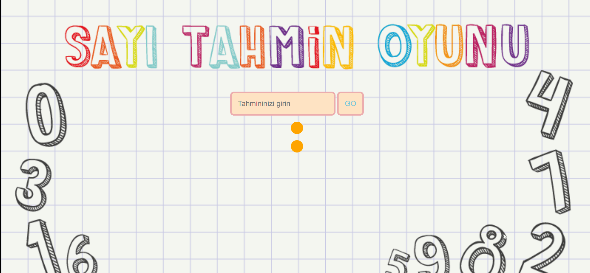

# hw-js-Guess-Number
https://ilkaybasboga.github.io/hw-js-guessnumber/

# Project : Guess-Number Website 

## Conclusion



## Description
I aimed to create a Guess-Number Website  project with JS.


## Project Skeleton 

```
Guess-Number Website  . (folder)
|
|----README.md               
|---- img (images)            
|----index.html  
|----style.css
|----app.js
 
```


## Steps to Solution
  
- Step 1: Creating the HTML structure,

- Step 2:CSS folder structure was created,

- Step 3: JS algorithm coded

- Step 4: Created Website
 
- Step 5: Submit your app to your own public repository on Github
